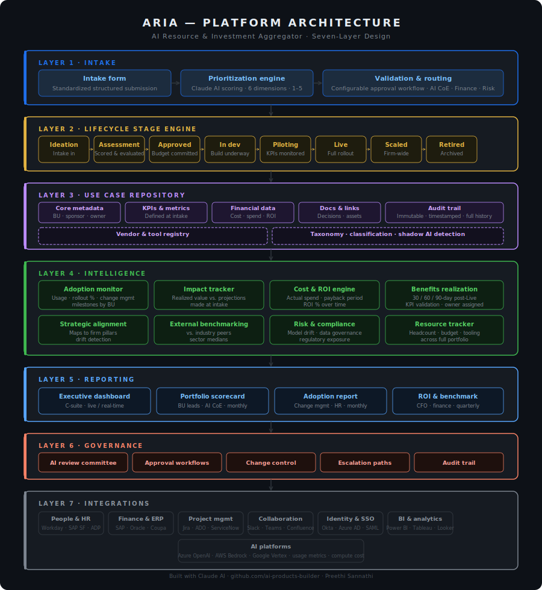

# ARIA — AI Resource & Investment Aggregator

> **Score, prioritize, and prove the value of every enterprise AI initiative — with executive-ready reporting built in.**

ARIA is an enterprise AI portfolio management platform that gives AI program leaders a single source of truth for every initiative — from first idea through go-live to realized ROI. It enforces a structured lifecycle, automates scoring and prioritization, and closes the loop between what AI was supposed to deliver and what it actually did.

---

## The problem

Enterprise AI programs are scaling fast, but most organizations still can't answer the questions leadership asks most:

- Which AI initiatives are delivering measurable business value?
- Are we investing in the right use cases across the right business lines?
- How do we prioritize when everything feels urgent and resources are finite?
- What is our realized vs. projected ROI across the full AI portfolio?

Without a governance layer, AI runs in silos. Business lines submit use cases informally. Prioritization is political, not analytical. Costs scatter across budgets. No one can prove whether the investment paid off.

ARIA is the governance layer enterprise AI programs are missing.

---

## What ARIA does

ARIA lets teams log, score, track, and report on AI initiatives across every business line. It uses Claude AI to automatically evaluate each use case across three core dimensions, then surfaces a ranked portfolio view that helps leadership make faster, better-funded decisions.

| Dimension | What it measures |
|---|---|
| **Strategic fit** | Alignment to business goals and long-term strategic priorities |
| **Feasibility** | Technical readiness, data availability, and execution complexity |
| **Estimated ROI** | Projected value delivery relative to cost, effort, and risk |

Every initiative gets a composite score. The portfolio view ranks them, surfaces trade-offs, and generates the reports leadership actually needs — without requiring a data analyst to produce them.

---

## Key features

- **Structured intake** — Standardized submission form captures business context, sponsor, KPIs, cost estimates, and risk flags. No freeform submissions, no missing fields.
- **Claude-powered scoring** — Automatic evaluation of strategic fit, feasibility, and ROI using Claude AI. Configurable weights per the AI CoE's priorities.
- **8-stage lifecycle engine** — Enforced gate criteria at every stage transition. Use cases can't auto-advance; an owner must confirm exit criteria are met.
- **Portfolio dashboard** — Ranked view of all active initiatives with adoption metrics, stage status, and realized vs. projected value.
- **Benefits realization tracking** — Automated 30/60/90-day post-Live KPI reviews assigned to named owners. Escalates automatically if missed.
- **Vendor & tool registry** — Tracks every AI tool and vendor in use, linked to dependent initiatives. Detects shadow AI on submission.
- **External benchmarking** — Compares AI investment performance to industry peers to give leadership context for ROI figures.
- **Executive report export** — One-click dashboard, scorecard, and ROI reports formatted for senior leadership and board-level communication.
- **Enterprise integrations** — Connects to HRIS, finance/ERP, project management, collaboration tools, identity providers, and BI platforms to eliminate manual data entry.

---

## Built for

- **AI program leaders** managing multi-initiative portfolios across business lines
- **AI Centers of Excellence** responsible for prioritization, governance, and value measurement
- **Strategy and finance teams** needing defensible visibility into AI investment performance
- **CTOs, CDOs, and CIOs** reporting AI value to executive leadership and the board

---

## Platform architecture

ARIA is organized into seven layers, each with a distinct responsibility.



| Layer | Responsibility |
|---|---|
| **1. Intake** | Structured submission · Claude-powered scoring · Approval routing |
| **2. Lifecycle** | 8-stage pipeline · Enforced gate criteria · Staleness alerts |
| **3. Repository** | Use case records · Vendor registry · KPIs · Audit trail |
| **4. Intelligence** | Adoption · Impact · Cost/ROI · Benefits realization · Benchmarking |
| **5. Reporting** | Dashboard · Scorecard · Adoption report · ROI & benchmark report |
| **6. Governance** | Review committees · Approvals · Change control · Escalation |
| **7. Integrations** | HRIS · Finance/ERP · Jira · Slack · SSO · BI tools · AI platforms |

---

## Core modules

### 1. Intake

Every use case enters ARIA through a standardized intake form. The form captures:

- Problem statement and business line
- Executive sponsor and named owner
- Estimated cost, effort, and timeline
- Expected business impact and success KPIs
- Data requirements and risk flags

Submissions are automatically scored by the prioritization engine across six dimensions: strategic fit, expected impact, cost, feasibility, resource availability, and risk. Each dimension is rated 1–5 with configurable weights. The engine produces a composite score, surfaces trade-offs, and routes the submission to the appropriate reviewers — AI CoE, finance, or risk — via a configurable approval workflow.

---

### 2. Lifecycle stage engine

Every use case progresses through eight defined stages. Transitions require explicit gate actions — no auto-advancing, no skipping. An authorized owner must confirm exit criteria before a stage moves forward.

| Stage | Description | Gate to exit |
|---|---|---|
| **Ideation** | Intake submitted | Sponsor identified, problem statement defined |
| **Assessment** | Feasibility, cost, and risk evaluated | Prioritization score confirmed, go/no-go decision made |
| **Approved** | Budget and resources formally committed | Team assigned, KPIs locked |
| **In development** | Build underway, tracked in PM tool | UAT passed, pilot environment ready |
| **Piloting** | Limited rollout, KPIs actively monitored | KPI threshold met, scale approved by sponsor |
| **Live** | Full production rollout | 90-day benefits review completed |
| **Scaled** | Rolled out across BU or firm-wide | Value sustained, transitioned to routine operations |
| **Retired** | Decommissioned or superseded | Lessons captured, record archived |

**Staleness alerts** trigger automatically when a use case in any active stage (Assessment through Scaled) has not been updated in 60 days. The record owner is notified in their configured collaboration tool. The AI CoE sees a portfolio-level flag on the dashboard.

---

### 3. Repository

The repository is the authoritative record for every use case, active or archived. Each record contains:

- **Core metadata** — name, description, business line, BU, sponsor, owner
- **Stage and status** — current lifecycle stage, last updated timestamp, full gate history
- **KPIs and success metrics** — defined at intake, tracked from piloting through live
- **Financial data** — projected cost, actual spend, projected ROI, realized ROI
- **Documentation links** — linked assets, decision records, architecture docs, meeting notes
- **Taxonomy** — function, technology type, data domain, risk classification
- **Audit trail** — immutable log of every change, decision, and gate action

#### Vendor & tool registry

A linked entity within the repository. Every use case references the AI tools and vendors it depends on. The registry tracks vendor name, contract status and renewal date, license count and cost, risk classification, and the full list of dependent use cases — enabling impact analysis before any contract decision. Any tool submitted that is not already in the registry triggers a shadow AI flag for AI CoE review.

---

### 4. Intelligence layer

Eight modules read continuously from the repository and produce the signals that feed reporting and escalation:

| Module | What it tracks |
|---|---|
| **Adoption monitor** | User counts, rollout %, change management milestones by BU |
| **Impact tracker** | Realized business value vs. projections made at intake |
| **Cost & ROI engine** | Actual spend vs. budget, payback period, ROI % over time |
| **Benefits realization** | 30/60/90-day post-Live KPI validation with owner accountability |
| **Strategic alignment** | Use case mapping to firm strategic pillars; flags drift when priorities shift |
| **External benchmarking** | AI investment performance vs. industry peers and sector medians |
| **Risk & compliance** | Model drift, data governance issues, regulatory exposure flags |
| **Resource tracker** | Headcount allocation, budget committed, tooling usage across the full portfolio |

#### Benefits realization process

Going Live is the starting gun, not the finish line. When a use case moves to Live, ARIA automatically creates three scheduled review tasks assigned to the named benefits realization owner:

- **Day 30** — early signal check
- **Day 60** — trend confirmation
- **Day 90** — formal KPI validation against intake projections

If the owner does not complete a task within a 5-business-day grace period, it escalates automatically to the AI CoE and the business sponsor. Actual KPI values are logged against projections and feed directly into the ROI engine and reporting layer. This is the mechanism that closes the loop between what was promised and what was delivered.

---

### 5. Reporting

| Report | Primary audience | Cadence |
|---|---|---|
| **Executive dashboard** | C-suite, AI steering committee | Live / real-time |
| **Portfolio scorecard** | Business line leads, AI CoE | Monthly |
| **Adoption report** | Change management, HR, BU leads | Monthly |
| **ROI & benchmark report** | CFO, finance, board | Quarterly |

All reports render natively in ARIA and are available as a live data feed to connected BI tools. The benchmark report contextualizes internal ROI figures against external peer data — giving leadership the "compared to what?" that raw numbers alone can't provide.

---

### 6. Governance

ARIA enforces process integrity at every layer:

- **AI review committee** — defines and adjusts prioritization weights, approves high-cost or high-risk use cases, conducts quarterly portfolio reviews
- **Approval workflows** — configurable multi-step approvals for stage transitions, budget commitments, and vendor additions
- **Change control** — scope changes to approved use cases require a formal re-assessment gate before proceeding
- **Escalation paths** — automated escalation for stale records, missed benefits reviews, budget overruns, and risk threshold breaches
- **Audit trail** — immutable, timestamped log of every decision, change, approval, and gate action across the platform

---

### 7. Integrations

ARIA integrates with existing enterprise systems to eliminate manual data entry and ensure every figure in the platform is authoritative.

| Domain | Example systems | What ARIA uses it for |
|---|---|---|
| **People & HR** | Workday, SAP SuccessFactors, ADP | Headcount allocation, org hierarchy, skills matching |
| **Finance & ERP** | SAP, Oracle Financials, Workday Finance, Coupa | Actual spend, approved budget, vendor invoices |
| **Project management** | Jira, Azure DevOps, ServiceNow, Asana | Stage status, milestone completion, blocker tracking |
| **Collaboration** | Slack, MS Teams, Outlook, Confluence | Notifications, approval routing, document links |
| **Identity & security** | Azure AD, Okta, Ping Identity, SAML/OIDC | SSO, role-based access control, user provisioning |
| **BI & analytics** | Power BI, Tableau, Looker, Snowflake | Custom reporting, executive data feeds |
| **AI platforms** | Azure OpenAI, AWS Bedrock, Google Vertex | Usage metrics, token consumption, compute cost |

**Recommended rollout order:**

1. SSO / identity — required before any users can access the platform
2. Project management — eliminates dual-entry for teams already using Jira or ADO
3. Finance / ERP — enables real cost data instead of estimates
4. HR / HRIS — enriches resource tracking with authoritative headcount data
5. Collaboration tools — routes notifications and approvals to where people already work
6. BI tools — extends reporting reach to existing executive dashboards
7. AI platforms — closes the loop on actual usage data and compute cost

---

## Prioritization framework

The scoring engine evaluates every submitted use case across six dimensions. Weights are fully configurable by the AI CoE to reflect the firm's current strategic priorities.

| Dimension | What it measures |
|---|---|
| **Strategic fit** | Alignment to the firm's long-term strategic pillars |
| **Expected impact** | Revenue upside, cost savings, efficiency gain, or risk reduction |
| **Feasibility** | Technical complexity, data readiness, and team capability |
| **Cost** | Total investment required — build, license, and run-state |
| **Resource availability** | Whether the people and budget needed are available now |
| **Risk** | Regulatory, data, model, and operational risk exposure |

Each dimension is scored 1–5. The engine produces a weighted composite score, flags significant trade-offs (e.g. high impact paired with high risk and low feasibility), and surfaces these before the submission reaches human reviewers.

---

## Success metrics

ARIA measures its own effectiveness as a platform:

| Metric | Target |
|---|---|
| % of AI initiatives submitted through formal intake | 100% |
| Time from submission to prioritization decision | < 10 business days |
| % of use cases with KPIs defined at intake | 100% |
| % of post-Live benefits reviews completed on time | > 90% |
| Portfolio-level realized vs. projected ROI ratio | Tracked quarterly |
| % of AI tools in registry vs. found in shadow AI audits | Trending to 100% |

---

## Roles & access

| Role | Access |
|---|---|
| **Business line submitter** | Submit and view their own use cases |
| **Business line lead** | View all use cases in their BU; approve stage transitions |
| **Benefits realization owner** | Complete assigned post-Live review tasks |
| **AI CoE member** | Full portfolio read access; configure prioritization weights |
| **AI CoE admin** | Full admin — users, workflows, integrations, registry |
| **Finance** | Cost, ROI, and budget views across the full portfolio |
| **Executive / board** | Dashboard and scorecard — read-only |

All roles are provisioned via SSO and synced from the firm's identity provider. Role assignment is managed in the IdP; ARIA does not maintain a separate user directory.

---

## Repository structure

```
/
├── docs/
│   ├── architecture/        System design and architectural decision records (ADRs)
│   ├── integrations/        Integration specs per external system
│   ├── data-model/          Repository schema and entity definitions
│   └── runbooks/            Operational runbooks for the AI CoE
├── src/
│   ├── intake/              Intake form and prioritization engine
│   ├── lifecycle/           Stage engine and gate enforcement
│   ├── repository/          Data layer and vendor registry
│   ├── intelligence/        Analytics modules and benefits realization scheduler
│   ├── reporting/           Dashboard, scorecard, and report generation
│   ├── governance/          Workflow engine, audit trail, and escalation
│   └── integrations/        Connectors per external system
├── infra/                   Infrastructure as code
└── tests/                   Test suites per module
```

---

## Tech stack

| Layer | Technology |
|---|---|
| Frontend | React |
| AI engine | Claude API (Anthropic) |
| Storage | Persistent key-value store |
| Reporting | Markdown / PDF export |

---

## Getting started

**Prerequisites:** Node.js 20+, Docker, access to firm SSO (contact IT for dev environment credentials)

```bash
# Clone the repo
git clone https://github.com/[org]/aria.git
cd aria

# Install dependencies
npm install

# Copy and configure environment
cp .env.example .env
# Fill in SSO, database, and integration credentials

# Start local development environment
docker compose up -d
npm run dev
```

Full setup guide: [`docs/runbooks/local-setup.md`](docs/runbooks/local-setup.md)

---

## Contributing

See [`CONTRIBUTING.md`](CONTRIBUTING.md) for branch conventions, PR review requirements, and the ADR process for architectural decisions.

Changes to prioritization framework weights or lifecycle gate criteria require AI CoE sign-off before merging to main.

---

## Author

**Preethi Sannathi** — AI & Data Platform Product Leader  
[linkedin.com/in/preethi-sannathi](https://linkedin.com/in/preethi-sannathi) · [github.com/ai-products-builder](https://github.com/ai-products-builder)

---

*Built with Claude AI · Designed for enterprise AI program leaders*
